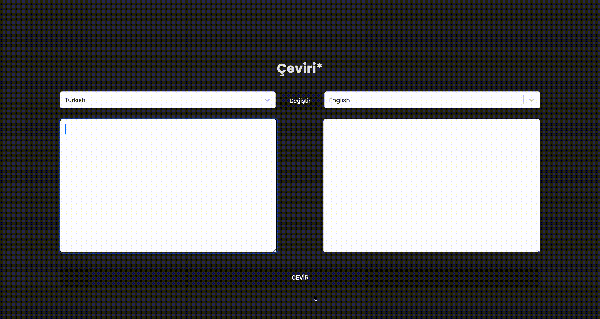

# Library
- sass react-redux 
- @reduxjs/toolkit
- axios
- react-select

# About the Project

- In this translation project, react toolkit was created by using thunk and obtaining api data. It provides translation in many languages and also has a modification feature. The image displayed during installation was obtained from the uiverse page. 
- Bu çeviri projesinde react toolkit thunk kullanılarak, api veri elde edilerek oluşturulmuştur. Pek çok dilde çeviri sağlar aynı zamanda değiştirme özelliği de mevcuttur. Yüklenme sırasında görüntülenen görsel uiverse sayfasından elde edilmiştir. 

# Project Gif:

